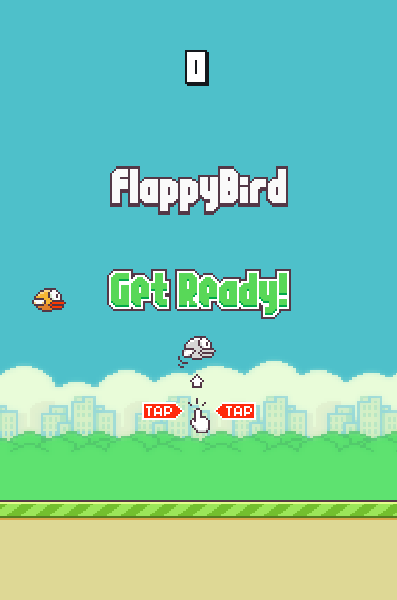
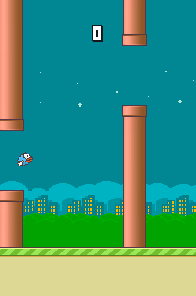

#FlappyBird++
=================

A Flappy Bird clone written in C++ and using the SFML Graphics Library

#Controls:
=================
Spacebar - Jump
Enter - Start the game / Restart the game after dying

#How To Compile (Linux / Windows):
==================================
- Install the SFML Libraries and Headers
- Edit the Makefile, and add the location of the SFML headers on INCLUDE_PATH and the location of SFML libraries on LIBRARY_PATH
- Run make	

Screenshots:
-----------

Debug Mode:
-----------
To toggle debug mode, type gotodebug on the game screen. Pressing backspace will clear
the text entered buffer.

To Do:
------
- Add highscores?
- Make the bird's bounding box rotate with it

Assets are from:
- [FlapPyBird](https://github.com/sourabhv/FlapPyBird/)
